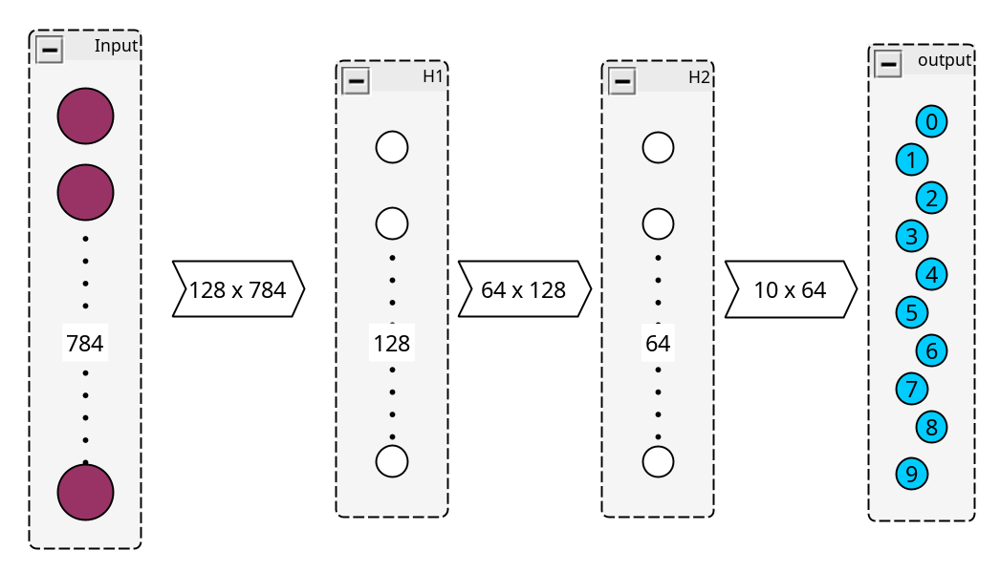

```
 An OCR neural network using MNIST dataset written in C from scratch
 Trained to identify handwritten single digit numerals from 0 to 9

 Will include both serial and parallel versions of the code
```

\[TODO] update readme

# a-very-simple-OCR


### How to use:

All scripts include the file `config.h`
```
config.h:

#ifndef CONFIG_H
#define CONFIG_H

// Uncomment to enable OpenMP
#define USE_OMP

#endif
```

all pragmas are wrapped with:
```
#ifdef USE_OMP
#pragma omp parallel...
#endif
```

If `USE_OMP` is not defined, the C pre-processor will ignore the pragmas, effectively using single threading.

The neural network library:

- `cnnlib.c` includes the implementation of the training loop functions
- `cnnlib.h` describes the function declarations and architecture structs


Main scripts:
- `dot-prod-test.c` tests the difference between naive parallel dot product and tiled dot product
- `random-nn-test.c` tests the neural network on a randomized dataset, accuracy and loss are ignore, used to test the speed gain of parallelism
- `left-right-nn.c` runs the neural network on a generated simple dataset of 2 classes, 1 class has pixels on the left, 1 class has pixels on the right, used to sanity test weight update logic
- `mnist-nn.c` runs the neural network on the **mnist handwritten character** dataset


### Neural Network Architecture

3 Layer neural network + Input layer:
 - Input layer
 - Hidden layer 1
 - Hidden Layer 2
 - Output Layer

**Notation:** \[TODO]
- $a_{ij}$ is the activation of neuron $j$ on layer $i$
- $z_{ij}$ is the output of neuron $j$ of layer $i$
- $w_{ij}$ is the weight of the edge between neuron $i$ of 1 layer to neuron $j$ of the next layer during vector dot product operations



### Forward Propagation

1. Input image $x$ (784×1) → $z_1=W_1x+b_1z_1​=W_1​x+b_1$​ → ReLU → $a_1$​ (128×1).
2. $a_1 → z_2=W_2a_1+b_2z_2=W_2​a_1​+b_2$​ → ReLU → $a_2$​ (64×1).
3. $a_2​ → z_3=W_3a_2+b_3z_3​=W_3​a_2​+b_3​$ → Softmax → $a_3$ (10×1).    

The sizes of the Hidden layers $H1$ 128, and $H2$ 64, are arbitrary 

The **loss** (cross-entropy) compares $a3$ to the true label $y$.

### Backward Propagation
Backwward propagation is the process of fine-tuning weights according to the loss computed from previous epochs.
1. **Gradient Calculation:**The loss derivaties of each layer is computed, starting from the output layer and moving backward.
2. **Weight updates:**Weights are updated using gradient descent according to the calculated gradients, aiming to minimize the loss.

\[TODO]


## Math Library

`matrix-math.h` includes functions to initialize, add, and dot product generic 2D matricies


```
 typedef struct {
   int rows, columns;
   double **data;
 } Matrix;
```
Matrix struct encapsulates double data and size information

```
 Matrix *add_Mat(Matrix *mat1, Matrix *mat2)
```
Adds mat1 and mat2, returns pointer to `Matrix *result`.
Exits with error code if matricies are not of same size.

```
 Matrix *dot_Mat(Matrix *mat1, Matrix *mat2)
```
Calculates dot product of mat1 and mat2, returns pointer to `Matrix *result`.
Exits with error code if matricies are not of correct sizes mxn and nxp.
